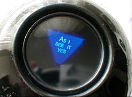

# Magic 8 Ball

For this mini project you're going
to create a Magic 8 Ball.



You're going to ask your Magic 8 Ball a yes or no
question and it will randomly give you an answer. 

## Steps

### 1. Ask the user a question
The user is going to ask your 8 ball
a yes or no question. Your code needs
to prompt them for this question.

Use the `input` function to display
a prompt and store the response in 
a variable.

```python
ans = input("What would you like to ask?")
```

This code will run and display `What would you
like to ask?` on the console. The user
can then type in their question. Their
response is stored in the `ans` variable.

### 2. Pick a random number
Next you've got to generate a random
number. We're going to use the `random.randint()` 
function for this. 

`random.randint` takes two parameters, a minimum
and maximum value and returns an integer in that
range, inclusive. For example, `random.randint(1,5)`
will randomly return a number between 1 and 5, 
inclusive (it can be 1 and can be 5).

The code below will randomly select an
integer from 1 to 9 and store it in the 
`rnd` variable. 

```python
rnd = random.randint(1,9)
```

In your code, call the `random.randint` to with a range
of at least 5 numbers and store that value in a variable.
`num` is probably a good name for your variable.

### 3. The 8 Ball answers
Last you need a series of possible answers, one for each
possible random number. For example, if `num==1` maybe
your code should print out "Outlook looks good" or "No Way!" 

You're going to need an `if` / `elif` stack that covers
each of the possible values of `num`.  